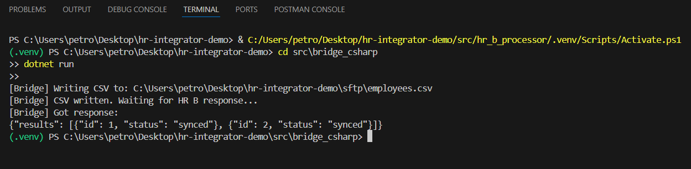

# HR Integrator Demo

Tämä demo on **taidonnäyte integraatio-osaamisesta**. Se simuloi kahden HR-järjestelmän (HR A ja HR B) välistä tietojen siirtoa integraatiosillan (Bridge) avulla.

## Kokonaisuus

- **HR A Mock (Python + Flask)**
  - Kevyt REST API, joka simuloi HR-järjestelmää A.
  - Palauttaa työntekijälistan JSON-muodossa selaimessa.

- **Bridge (C#, .NET 8)**
  - Integraatiosilta järjestelmien välillä.
  - Hakee työntekijät HR A:lta.
  - Tallentaa tiedot CSV-muodossa `sftp`-kansioon.
  - Odottaa HR B:n vastausta `response.json`-tiedostossa.

- **HR B Processor (Python)**
  - Simuloi HR-järjestelmää B.
  - Lukee `employees.csv`-tiedoston.
  - Luo `response.json`, jossa työntekijät merkitään `synced`-tilaan.

---

## Teknologiat

- **Python 3.10+** (Flask, JSON, tiedostojen käsittely)
- **.NET 8 SDK (C#)** (CSV-käsittely, tiedostojono)
- **Windows PowerShell / VS Code** kehitysympäristönä

## Demo Output

Kuten kuvasta näkyy:
- CSV kirjoitettiin onnistuneesti
- Odotettiin HR B:n vastausta
- Integraatio onnistui (`synced`)

---

## Käynnistys

### 1. Vaatimukset
- Asennettuna:
  - [Python 3.10+](https://www.python.org/downloads/)
  - [.NET 8 SDK](https://dotnet.microsoft.com/en-us/download)

- Virtuaaliympäristö Pythonille ('.venv') sekä riippuvuudet asennettuna:
  powershell
  pip install flask

